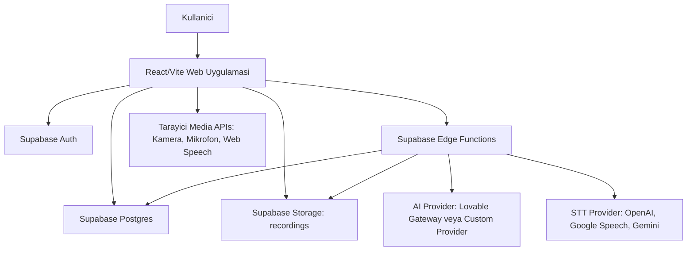

# Insightful Meetings / Biveyos Proje Dokumantasyonu

Son guncelleme: 2026-05-29

Bu dokuman, `/Users/efecanakbulut/Downloads/insightful-meetings-main` projesinin mimarisini, calisma mantigini, veri akisini, Supabase backend katmanini ve kaynak dosyalarin ne ise yaradigini aciklar. `node_modules` ve `dist` klasorleri kaynak kod degil; biri harici paketler, digeri uretilmis build ciktisidir. Bu nedenle dosya envanterinde kaynak ve proje konfigurasyon dosyalari detaylandirilmistir.

## 1. Genel Ozet

Proje, toplanti ve mulakat kayitlarini analiz eden React tabanli bir web uygulamasidir. Kurumsal tarafta toplantilar, mulakatlar, Biveyos CRM, coklu mikrofon, transkript, duygu durum/kamera sinyalleri, sirket ekip uyeleri, sektor radari ve raporlar vardir. Bireysel tarafta pratik mulakat, karakter analizi, kariyer profili, gunluk egitim ve AI kariyer kocu vardir.

Ana teknoloji seti:

- Frontend: Vite, React 18, TypeScript, React Router, TanStack Query
- UI: Tailwind CSS, shadcn-ui/Radix UI, lucide-react ikonlari
- Backend: Supabase Auth, Postgres, Storage, Edge Functions
- AI katmani: Supabase Edge Functions uzerinden Lovable AI Gateway veya custom OpenAI uyumlu provider
- Ses/transkript: OpenAI STT, Google Speech-to-Text, Gemini fallback zinciri
- Kamera/duygu durum: Browser camera frame yakalama ve `analyze-facial-expressions` edge function

## 2. Ust Seviye Mimari



Frontend tarayicida calisir. Mikrofon/kamera izinleri tarayicidan alinir. Kayit dosyalari Supabase Storage `recordings` bucket'ina yuklenir. Analiz, transkript ve sektor/kariyer gibi AI islemleri edge function'lara gonderilir. Sonuclar Postgres tablolarina kaydedilir.

## 3. Ana Route Haritasi

Route tanimlari `src/App.tsx` icindedir.

| Route | Ekran | Amac |
| --- | --- | --- |
| `/` | `Index` | Landing/giris sayfasi |
| `/auth` | `AuthPage` | Giris, kayit, hesap tipi secimi |
| `/reset-password` | `ResetPasswordPage` | Sifre sifirlama |
| `/dashboard` | `DashboardLayout` + `DashboardHome` | Kurumsal panel ana sayfasi |
| `/dashboard/record` | `RecordPage` | Canli kayit, dosya yukleme, Zoom/Meet, Biveyos akis merkezi |
| `/dashboard/biveyos` | redirect | Artik `/dashboard/record` icine tasinmis |
| `/dashboard/meetings` | `MeetingsPage` | Kaydedilmis toplantilar/mulakatlar |
| `/dashboard/meetings/:id` | `MeetingDetailPage` | Tek kayit detayi, analiz ve transkript |
| `/dashboard/company` | `CompanyPage` | Ekip uyeleri ve sirket analizi |
| `/dashboard/company/profile` | `CompanyProfilePage` | Sirket profili |
| `/dashboard/company/radar` | `SectorRadarPage` | Sektor gelismeleri ve risk/firsat analizi |
| `/dashboard/company/:memberId` | `MemberDetailPage` | Ekip uyesi detay ve AI profil analizi |
| `/dashboard/advisor` | `CompanyAdvisorPage` | Sirket danismani / chat |
| `/dashboard/executive` | `ExecutiveOverviewPage` | Yonetici ozet paneli |
| `/dashboard/analytics` | `AnalyticsPage` | Analitik ekran |
| `/dashboard/reports` | `ReportsPage` | Raporlar |
| `/dashboard/integrations` | redirect | Su an ayarlara yonlendiriliyor |
| `/dashboard/billing` | `BillingPage` | Faturalama placeholder/ekrani |
| `/dashboard/settings` | `SettingsPage` | Profil ayarlari |
| `/individual` | `IndividualLayout` + `IndividualHome` | Bireysel kullanici ana paneli |
| `/individual/practice` | `PracticeInterviewPage` | AI destekli pratik mulakat |
| `/individual/history` | `PracticeHistoryPage` | Pratik gecmisi |
| `/individual/history/:id` | `PracticeDetailPage` | Pratik detayi |
| `/individual/daily` | `DailyTrainingPage` | Gunluk egitim ve mikro test |
| `/individual/coach` | `AICareerCoachPage` | AI kariyer kocu |
| `/individual/profile` | `CareerProfilePage` | Kariyer profili |
| `/individual/analysis` | `CharacterAnalysisPage` | Toplam karakter analizi |
| `/individual/settings` | `SettingsPage` | Bireysel ayarlar |

## 4. Kritik Kullanici Akislari

### 4.1 Canli Toplanti / Mulakat Kaydi

1. Kullanici `/dashboard/record` ekraninda kayit tipini secer.
2. `RecordingSetupForm` toplantinin veya mulakatin bilgilerini toplar.
3. Mulakat akisinda Biveyos modu acilabilir; aday bilgisi, pozisyon, CV ve AI soru seti hazirlanir.
4. Kamera ve mikrofonlar `RecordPage` veya `BiveyosPage` tarafindan `navigator.mediaDevices` ile acilir.
5. Kayit sirasinda:
   - Web Speech API destekleniyorsa canli transkript taslagi uretilir.
   - Kamera frame'leri kucultulerek tutulur.
   - Biveyos modunda coklu mikrofon kanallari ayri ayri kaydedilir.
6. Kayit bitince medya Supabase Storage'a yuklenir.
7. Transkript icin `transcribe-recording` edge function cagrilir.
8. Kamera sinyalleri icin `analyze-facial-expressions` cagrilir.
9. Ana AI raporu icin `analyze-interview` cagrilir.
10. Sonuc `recordings` tablosuna, aksiyonlar `action_items` tablosuna, kisi icgoru verileri gerekiyorsa `member_meeting_insights` tablosuna yazilir.

### 4.2 Biveyos CRM / Mulakat

`BiveyosPage.tsx` aday kaydini localStorage icinde tutar. Aday havuzu hazir veriyle gelmez; kullanici aday bilgilerini manuel girer. Aday icin:

- On degerlendirme: `biveyos-pre-evaluation`
- Onerilen sorular: `generate-practice-questions`
- Coklu mikrofon kaydi: her kanal ayri `MediaRecorder`
- Kanal transkriptleri: `transcribe-recording`
- Duygu durum: periyodik kamera frame analizi
- Final rapor: `analyze-interview`

Canli duygu durum icin `LIVE_EMOTION_CAPTURE_INTERVAL_MS = 2000`, `LIVE_EMOTION_ANALYSIS_INTERVAL_MS = 6000` kullanilir. Frame'ler `src/lib/frameSampling.ts` ile 640px civarina kucultulur ve son karelerden dengeli ornek secilir.

### 4.3 Dosya Yukleme Analizi

`FileUploadSection` ve eski `UploadPage` ses, video veya transkript dosyalarini isler. Kucuk dosyalarda inline transkript, buyuk dosyalarda `process-recording` ile chunk/polling mantigi vardir. Is durumlari `processing_jobs` tablosunda tutulur.

### 4.4 Zoom / Google Meet

Zoom UI artik kayit ve transkript yukleme odaklidir. Meeting ID ile getirme UI'dan kaldirilmistir. `ZoomImportSection` yuklenen Zoom kaydi/transkriptini `recordings` tablosuna kaydeder ve `analyze-interview` ile analiz eder. `GoogleMeetSection` Meet transkriptini dosya veya metin olarak alip analiz eder.

### 4.5 Bireysel Pratik Mulakat

`PracticeInterviewPage` pozisyon, departman, beceri, zorluk ve stil bilgilerini alir. `generate-practice-questions` soru seti uretir. Kullanici kamera/mikrofonla pratik yapar. Kayit sonunda `transcribe-recording` ve `analyze-practice-interview` ile skor, cevap bazli geri bildirim, SWOT, kariyer yol haritasi ve aksiyon plani uretilir.

## 5. Veri Modeli

Supabase tablolarinin ana gorevleri:

| Tablo | Gorev |
| --- | --- |
| `profiles` | Kullanici profili ve `account_type` bilgisi |
| `recordings` | Toplanti/mulakat kayitlari, transkript, analiz verisi, video URL, Biveyos sinyalleri |
| `action_items` | Kayitlardan cikarilan aksiyon maddeleri |
| `company_members` | Sirket/ekip uyesi CRM kayitlari |
| `member_meeting_insights` | Ekip uyesinin kayit bazli katkisi ve davranissal icgoruleri |
| `practice_interviews` | Bireysel pratik mulakat gecmisi |
| `custom_interview_questions` | Kullaniciya ozel mulakat sorulari |
| `interview_question_templates` | Kaydedilmis soru seti sablonlari |
| `career_profiles` | Bireysel kariyer profili, beceriler ve AI icgoruleri |
| `daily_training` | Gunluk egitim, sorular, cevaplar, skor ve streak |
| `processing_jobs` | Yuklenen buyuk dosyalarin isleme durumu |
| `company_profiles` | Sirket sektoru, urunleri, riskleri, hedef pazar bilgisi |
| `sector_developments` | Sektor radari gelismeleri, risk/firsat yorumlari |
| `advisor_history` | Sirket danismani soru-cevap gecmisi |

Tum ana tablolarda RLS politikalari kullanici bazli olacak sekilde kurgulanmistir. Kullanici sadece kendi `user_id` veya `auth.uid()` ile eslesen kayitlari gorur/duzenler.

## 6. Edge Function Mimarisi

Edge function'lar `supabase/functions` altindadir. Ortak AI istemcisi `_shared/ai-client.ts` icindedir.

| Function | Gorev |
| --- | --- |
| `analyze-interview` | Toplanti veya mulakat transkriptini analiz eder; skorlar, ozet, aksiyonlar, davranissal sinyaller ve Biveyos alanlari uretir |
| `transcribe-recording` | Storage'daki ses/video dosyasindan Turkce transkript uretir |
| `process-recording` | Buyuk ses dosyalarini chunk'lara ayirarak transkript islemini takip eder |
| `analyze-facial-expressions` | Kamera frame'lerinden yuz gorunurlugu, duygu/katilim, bakis kaniti ve gozlem limitleri uretir |
| `biveyos-pre-evaluation` | Aday bilgisi, CV ve pozisyon bilgisine gore on degerlendirme uretir |
| `generate-practice-questions` | Pozisyon/stil/zorluk parametrelerine gore mulakat sorulari uretir |
| `analyze-practice-interview` | Bireysel pratik mulakat performansini analiz eder |
| `analyze-character-overall` | Birden fazla pratikten genel karakter/profil analizi uretir |
| `analyze-career-profile` | Kariyer profilini ve pratik gecmisini birlikte analiz eder |
| `generate-daily-training` | Gunluk egitim sorulari ve gorevleri uretir |
| `analyze-micro-test` | Gunluk egitim cevaplarini degerlendirir |
| `career-coach-insights` | Kariyer kocu icin toplu icgoru uretir |
| `career-coach-chat` | Kariyer kocu sohbet cevabi uretir |
| `ai-career-coach` | Pratik gecmisine gore kocluk onerileri uretir |
| `company-advisor` | Sirket profili, kayitlar, aksiyonlar ve sektor kaynaklariyla danismanlik/sector radar islemleri yapar |
| `analyze-company` | Ekip uyeleri ve notlar uzerinden sirket/ekip analizi uretir |
| `analyze-member-profile` | Tek ekip uyesi icin toplanti icgorulerinden profil analizi uretir |
| `save-member-insights` | Analizden gelen kisi bazli sinyalleri `member_meeting_insights` tablosuna kaydeder |
| `meeting-assistant` | Canli toplantida anlik asistan cevaplari uretir |
| `zoom-import` | Zoom API ile kayit/transkript cekme altyapisini icerir; UI su an yukleme odakli |
| `parse-linkedin` | LinkedIn URL kalibindan kariyer profil taslagi uretir |

## 7. Transkript Akisi

`transcribe-recording` su sirayla calisir:

1. Supabase Storage `recordings` bucket'indan dosya boyutunu ve dosyayi alir.
2. MIME tipini uzantiya gore belirler.
3. `transcribeWithSpeechProvider` cagrilir.
4. Provider zinciri:
   - OpenAI: `OPENAI_TRANSCRIBE_MODEL` varsa o; yoksa `gpt-4o-mini-transcribe`, sonra `whisper-1`
   - Google Speech: servis hesabi JSON veya API key ile
   - Gemini: `GEMINI_TRANSCRIBE_MODEL` veya `gemini-2.5-flash`
5. Bos veya sahte/placeholder transkript reddedilir.
6. `b2b-intelligence` yardimcilari ozel isimleri normalize eder.
7. `recordingId` varsa transkript `recordings.transcript` alanina yazilir.

Frontend canli transkript ayrica Web Speech API ile denenir. Bu sadece tarayici destekliyorsa calisir; destek yoksa final transkript kayit sonu edge function ile uretilir.

## 8. Kamera ve Duygu Durum Akisi

`src/lib/frameSampling.ts` kamera analizinin ortak yardimcisidir:

- `captureVideoFrameDataUrl`: video elementinden JPEG frame alir, genisligi 640px civarina indirir.
- `sampleLatestFrames`: son frame penceresinden dengeli ornek secer.

`BiveyosPage`, `RecordPage` ve `PracticeInterviewPage` bu yardimciyi kullanir. `analyze-facial-expressions` son frame'leri alir, AI vision modeline gonderir ve su alanlari dondurur:

- `dominant_mood`
- `average_confidence`
- `average_engagement`
- `common_expressions`
- `face_visibility`
- `camera_facing`
- `gaze_evidence`
- `eye_contact_confidence`
- `visual_commentary_confidence`
- `observational_limits`

Bu sistem psikolojik teshis yapmaz; sadece gorunebilir yuz/kamera sinyallerini destekleyici veri olarak yorumlar.

## 9. Gerekli Ortam Degiskenleri

Frontend `.env`:

- `VITE_SUPABASE_URL`
- `VITE_SUPABASE_PUBLISHABLE_KEY`
- `VITE_SUPABASE_PROJECT_ID`

Supabase Edge Function secret'lari:

- `LOVABLE_API_KEY`: default AI gateway icin
- `CUSTOM_AI_API_URL`, `CUSTOM_AI_API_KEY`, `CUSTOM_AI_MODEL`: custom OpenAI uyumlu provider icin
- `SUPABASE_URL`, `SUPABASE_ANON_KEY`, `SUPABASE_SERVICE_ROLE_KEY`: server-side Supabase islemleri icin
- `OPENAI_API_KEY` veya `OPENAI_TRANSCRIPTION_API_KEY`: OpenAI STT icin
- `OPENAI_TRANSCRIBE_MODEL`: opsiyonel STT model override
- `GOOGLE_APPLICATION_CREDENTIALS_JSON`, `GOOGLE_SERVICE_ACCOUNT_JSON` veya `GOOGLE_CLOUD_SERVICE_ACCOUNT_JSON`: Google Speech OAuth icin
- `GOOGLE_SPEECH_TO_TEXT_API_KEY`, `GOOGLE_SPEECH_API_KEY`, `GOOGLE_CLOUD_SPEECH_API_KEY` veya `GOOGLE_CLOUD_API_KEY`: Google Speech API key icin
- `GEMINI_API_KEY` veya `GOOGLE_API_KEY`: Gemini fallback icin
- `GEMINI_TRANSCRIBE_MODEL`: opsiyonel Gemini STT model override
- `FACIAL_ANALYSIS_MODEL` veya `AI_VISION_MODEL`: yuz/kamera analiz modeli override
- `ZOOM_ACCOUNT_ID`, `ZOOM_CLIENT_ID`, `ZOOM_CLIENT_SECRET`: Zoom API icin

## 10. Dosya Envanteri

### 10.1 Kok Dosyalar

| Dosya | Gorev |
| --- | --- |
| `.env` | Lokal frontend Supabase public konfigurasyonu. Secret icermemeli. |
| `.gitignore` | Git'e alinmayacak dosyalari belirler. |
| `.lovable/plan.md` | Lovable tarafindan uretilen/planlanan proje notlari. |
| `README.md` | Lovable varsayilan kurulum ve calistirma dokumani. |
| `PROJE_DOKUMANTASYONU.md` | Bu kapsamli proje dokumani. |
| `package.json` | npm script'leri ve bagimliliklar. |
| `package-lock.json` | npm bagimlilik kilidi. |
| `bun.lock`, `bun.lockb` | Bun bagimlilik kilit dosyalari. Proje npm ile de calisiyor. |
| `index.html` | Vite HTML giris dosyasi; React root buraya mount edilir. |
| `vite.config.ts` | Vite konfigurasyonu, React plugin ve alias ayarlari. |
| `vitest.config.ts` | Test konfigurasyonu. |
| `eslint.config.js` | ESLint kurallari. |
| `tailwind.config.ts` | Tailwind tema, renk ve path konfigurasyonu. |
| `postcss.config.js` | Tailwind/autoprefixer PostCSS konfigurasyonu. |
| `components.json` | shadcn-ui component konfigurasyonu. |
| `tsconfig.json` | TypeScript ana konfigurasyon yonlendirmesi. |
| `tsconfig.app.json` | Uygulama TypeScript ayarlari. |
| `tsconfig.node.json` | Node/Vite konfigurasyon TypeScript ayarlari. |

### 10.2 Public Dosyalari

| Dosya | Gorev |
| --- | --- |
| `public/favicon.ico` | Tarayici sekme ikonu. |
| `public/placeholder.svg` | Placeholder gorsel. |
| `public/robots.txt` | Arama motoru robot talimatlari. |

### 10.3 Uygulama Girisi ve Global Stil

| Dosya | Gorev |
| --- | --- |
| `src/main.tsx` | React uygulamasini `#root` elementine mount eder. |
| `src/App.tsx` | Router, layout, provider ve route haritasini kurar. |
| `src/index.css` | Tailwind katmanlari, tema CSS degiskenleri ve global stiller. |
| `src/App.css` | Ek uygulama stilleri. |
| `src/vite-env.d.ts` | Vite TypeScript ortam tipleri. |

### 10.4 Sayfalar

| Dosya | Gorev |
| --- | --- |
| `src/pages/Index.tsx` | Public landing/giris sayfasi. |
| `src/pages/AuthPage.tsx` | Giris, kayit, sifre unutma ve hesap tipine gore yonlendirme. |
| `src/pages/ResetPasswordPage.tsx` | Yeni sifre belirleme ekrani. |
| `src/pages/DashboardLayout.tsx` | Kurumsal dashboard shell; sidebar ve outlet. |
| `src/pages/DashboardHome.tsx` | Kurumsal ozet kartlari, son kayitlar, pratik sayilari. |
| `src/pages/RecordPage.tsx` | Canli kayit, coklu mikrofon, kamera, transkript, dosya/Zoom/Meet modlari ve analiz merkezi. |
| `src/pages/BiveyosPage.tsx` | Biveyos CRM, aday kaydi, AI on degerlendirme, soru seti, coklu mikrofon, duygu durum paneli ve final rapor. |
| `src/pages/MeetingsPage.tsx` | `recordings` listesini getirir ve MeetingCard ile gosterir. |
| `src/pages/MeetingDetailPage.tsx` | Tek kaydin transkript, analiz, aksiyonlar, yeniden analiz ve paylasim detaylari. |
| `src/pages/AnalyticsPage.tsx` | Kayitlardan genel analitik metrikler. |
| `src/pages/ReportsPage.tsx` | Kayit raporlarini listeler/filtreler. |
| `src/pages/ExecutiveOverviewPage.tsx` | Yonetici ozeti; kayitlar, aksiyonlar, ekip, sektor riskleri ve pratik sayilari. |
| `src/pages/CompanyPage.tsx` | Ekip uyeleri CRUD ve sirket/ekip AI analizi. |
| `src/pages/CompanyProfilePage.tsx` | Sirket profil formu; sektor, pazar, operasyon, risk alanlari. |
| `src/pages/SectorRadarPage.tsx` | Sektor gelismeleri, otomatik kaynak tarama, risk/firsat analizi. |
| `src/pages/CompanyAdvisorPage.tsx` | Sirket danismani chat/soru cevap arayuzu. |
| `src/pages/MemberDetailPage.tsx` | Ekip uyesi bilgileri, kayit bazli icgoruler ve AI profil analizi. |
| `src/pages/BillingPage.tsx` | Faturalama/plan ekrani. |
| `src/pages/SettingsPage.tsx` | Kullanici profil ayarlari. |
| `src/pages/IntegrationsPage.tsx` | Entegrasyon kartlari; route su an settings'e yonlendiriliyor. |
| `src/pages/ZoomImportPage.tsx` | ZoomImportSection wrapper'i; ana akis RecordPage'e tasinmis. |
| `src/pages/UploadPage.tsx` | Eski/alternatif dosya yukleme ve analiz sayfasi; RecordPage icine benzer akis tasinmis. |
| `src/pages/IndividualLayout.tsx` | Bireysel kullanici layout'u. |
| `src/pages/IndividualHome.tsx` | Bireysel ana panel; son pratikler ve gunluk egitim bilgisi. |
| `src/pages/PracticeInterviewPage.tsx` | AI soru uretimi, kamera/mikrofonla pratik, transkript ve pratik analizi. |
| `src/pages/PracticeHistoryPage.tsx` | Bireysel pratik gecmisi. |
| `src/pages/PracticeDetailPage.tsx` | Tek pratik mulakat detayi. |
| `src/pages/CharacterAnalysisPage.tsx` | Birden fazla pratik uzerinden genel karakter analizi. |
| `src/pages/AICareerCoachPage.tsx` | Kariyer kocu icgoruleri ve chat bolumleri. |
| `src/pages/CareerProfilePage.tsx` | Kariyer profil formu, LinkedIn import ve AI kariyer analizi. |
| `src/pages/DailyTrainingPage.tsx` | Gunluk egitim, quiz/mikro test, skor ve feedback. |
| `src/pages/NotFound.tsx` | 404 fallback sayfasi. |

### 10.5 Ana Componentler

| Dosya | Gorev |
| --- | --- |
| `src/components/Navbar.tsx` | Public navigation. |
| `src/components/HeroSection.tsx` | Landing hero bolumu. |
| `src/components/FeaturesSection.tsx` | Landing ozellik kartlari. |
| `src/components/HowItWorksSection.tsx` | Landing calisma mantigi bolumu. |
| `src/components/CTAFooter.tsx` | Landing call-to-action/footer. |
| `src/components/AppSidebar.tsx` | Kurumsal dashboard navigasyon sidebar'i. |
| `src/components/NavLink.tsx` | Aktif route durumunu bilen link wrapper'i. |
| `src/components/RecordingSetupForm.tsx` | Toplanti/mulakat bilgisi, aday bilgisi, soru uretimi, Meet/Zoom girisleri. |
| `src/components/FileUploadSection.tsx` | Ses/video/transkript yukleme, queue, progress, processing_jobs ve analiz pipeline'i. |
| `src/components/ZoomImportSection.tsx` | Zoom kayit ve transkript dosyasi yukleme, kaydetme ve analiz. |
| `src/components/GoogleMeetSection.tsx` | Google Meet transkripti yukleme/yapistirma ve analiz. |
| `src/components/RecordingAnalysis.tsx` | Kayit analiz sonucunu, skorlarini, transkriptini, PDF/export benzeri aksiyonlari gosterir. |
| `src/components/MeetingCard.tsx` | Kayit liste karti; status/source turetir. |
| `src/components/MeetingAssistantChat.tsx` | Canli toplantida streaming chat asistan arayuzu. |
| `src/components/TranscriptViewer.tsx` | Basit transkript paneli; canli entries ve final transcript gosterimi. |
| `src/components/SmartTranscriptViewer.tsx` | Konusmaci ayrimi, arama ve segment mantikli gelismis transcript viewer. |
| `src/components/SpeechInsightsSection.tsx` | Konusma/iletisim sinyallerini gorsellestirir. |
| `src/components/InterviewQuestionsSidebar.tsx` | Mulakat soru setini yan panelde gosterir. |
| `src/components/CustomQuestionsManager.tsx` | Soru sablonlari ve ozel soru CRUD islemleri. |
| `src/components/ActionItemsList.tsx` | Kayit aksiyon maddelerini analizden senkronize eder ve CRUD islemleri yapar. |

### 10.6 Dashboard Yardimci Componentleri

| Dosya | Gorev |
| --- | --- |
| `src/components/dashboard/PageHeader.tsx` | Standart sayfa basligi. |
| `src/components/dashboard/StatCard.tsx` | Istatistik karti. |
| `src/components/dashboard/EmptyState.tsx` | Bos liste/bos ekran durumu. |
| `src/components/dashboard/LoadingState.tsx` | Yukleniyor durumu. |

### 10.7 Kariyer Componentleri

| Dosya | Gorev |
| --- | --- |
| `src/components/career/ProfileFormSection.tsx` | Kariyer profili form bolumleri. |
| `src/components/career/ProfileInsightsSection.tsx` | Kariyer profil AI icgorulerini gosterir. |

### 10.8 AI Kariyer Kocu Componentleri

| Dosya | Gorev |
| --- | --- |
| `src/components/coach/CoachChat.tsx` | Kariyer kocu chat arayuzu. |
| `src/components/coach/PostSessionActions.tsx` | Pratik sonrasi onerilen aksiyonlar. |
| `src/components/coach/PatternDetection.tsx` | Tekrarlayan davranis/performans kaliplari. |
| `src/components/coach/PerformanceSignals.tsx` | Performans sinyal kartlari. |
| `src/components/coach/CareerTrajectory.tsx` | Kariyer gelisim yonu ve trendleri. |
| `src/components/coach/SmartRecommendations.tsx` | AI onerileri. |
| `src/components/coach/ImprovementSection.tsx` | Gelisim alanlari. |
| `src/components/coach/OneLineTruth.tsx` | Kisa ozet/tek cumlelik icgoru. |

### 10.9 UI Componentleri

`src/components/ui` klasoru shadcn-ui/Radix tabanli temel arayuz parcalarini icerir. Bu dosyalar is kurali tasimaz; form, dialog, tab, tooltip, card, button gibi tekrar kullanilan UI primitives saglar.

| Dosya | Gorev |
| --- | --- |
| `accordion.tsx` | Accordion acilir/kapanir bolumleri. |
| `alert-dialog.tsx` | Onay/uyari modal dialog. |
| `alert.tsx` | Inline uyari kutusu. |
| `aspect-ratio.tsx` | Sabit oranli medya kapsayici. |
| `avatar.tsx` | Avatar gosterimi. |
| `badge.tsx` | Kucuk etiket/rozet. |
| `breadcrumb.tsx` | Breadcrumb navigasyon. |
| `button.tsx` | Buton varyantlari. |
| `calendar.tsx` | Takvim inputu. |
| `card.tsx` | Kart primitive'i. |
| `carousel.tsx` | Carousel/slider primitive'i. |
| `chart.tsx` | Recharts tema ve tooltip wrapper'lari. |
| `checkbox.tsx` | Checkbox inputu. |
| `collapsible.tsx` | Acilir/kapanir alan. |
| `command.tsx` | Command palette/list arayuzu. |
| `context-menu.tsx` | Sag tik/context menu. |
| `dialog.tsx` | Modal dialog. |
| `drawer.tsx` | Drawer panel. |
| `dropdown-menu.tsx` | Dropdown menu. |
| `form.tsx` | React Hook Form yardimcilari. |
| `hover-card.tsx` | Hover ile acilan kart. |
| `input-otp.tsx` | OTP inputu. |
| `input.tsx` | Text input. |
| `label.tsx` | Form label. |
| `menubar.tsx` | Menubar navigasyon. |
| `navigation-menu.tsx` | Navigation menu. |
| `pagination.tsx` | Sayfalama. |
| `popover.tsx` | Popover. |
| `progress.tsx` | Progress bar. |
| `radio-group.tsx` | Radio group. |
| `resizable.tsx` | Yeniden boyutlanabilir paneller. |
| `scroll-area.tsx` | Ozel scroll alanlari. |
| `select.tsx` | Select/dropdown input. |
| `separator.tsx` | Ayirici cizgi. |
| `sheet.tsx` | Side sheet panel. |
| `sidebar.tsx` | Sidebar primitive ve context. |
| `skeleton.tsx` | Loading skeleton. |
| `slider.tsx` | Slider input. |
| `sonner.tsx` | Sonner toast provider. |
| `switch.tsx` | Toggle switch. |
| `table.tsx` | Table primitive. |
| `tabs.tsx` | Tab primitive. |
| `textarea.tsx` | Textarea input. |
| `toast.tsx` | Toast primitive. |
| `toaster.tsx` | Toast renderer. |
| `toggle-group.tsx` | Toggle group. |
| `toggle.tsx` | Toggle button. |
| `tooltip.tsx` | Tooltip provider/trigger/content. |
| `use-toast.ts` | Toast hook. |

### 10.10 Lib, Hook, Type, Data

| Dosya | Gorev |
| --- | --- |
| `src/config/api.ts` | Public Supabase config, edge function isimleri ve request defaultlari. |
| `src/integrations/supabase/client.ts` | Supabase browser client. |
| `src/integrations/supabase/types.ts` | Supabase generated TypeScript DB tipleri. |
| `src/lib/edgeFunctionClient.ts` | Edge function invoke, retry, timeout ve hata siniflandirma katmani. |
| `src/lib/frameSampling.ts` | Kamera frame yakalama/kucultme ve son frame ornekleme. |
| `src/lib/mediaPlayback.ts` | Video `play()` race/AbortError hatalarini guvenli yakalayan yardimcilar. |
| `src/lib/audioExtraction.ts` | Video/ses dosyasindan audio cikarma yardimcilari. |
| `src/lib/videoProcessing.ts` | Video frame/medya isleme yardimcilari. |
| `src/lib/utils.ts` | `cn` gibi genel className yardimcilari. |
| `src/hooks/useTheme.ts` | Tema state hook'u. |
| `src/hooks/use-toast.ts` | Toast hook re-export/yardimcisi. |
| `src/hooks/use-mobile.tsx` | Mobil breakpoint algilama hook'u. |
| `src/types/recording.ts` | Mulakat/toplanti setup tipleri ve `InterviewQuestion`. |
| `src/types/biveyos.ts` | Biveyos raw sinyaller, AI yorumlari ve `extractBiveyosSignals`. |
| `src/data/mockMeetings.ts` | Mock toplanti verisi. |
| `src/test/setup.ts` | Vitest/JSDOM test setup. |
| `src/test/example.test.ts` | Ornek test. |

### 10.11 Supabase Shared Dosyalari

| Dosya | Gorev |
| --- | --- |
| `supabase/config.toml` | Supabase proje ID ve function JWT dogrulama ayarlari. |
| `supabase/.temp/cli-latest` | Supabase CLI lokal gecici dosyasi. |
| `supabase/functions/_shared/ai-client.ts` | AI provider secimi, `callAI`, hata ve JSON parse yardimcilari. |
| `supabase/functions/_shared/transcription-provider.ts` | OpenAI, Google Speech, Gemini STT provider zinciri. |
| `supabase/functions/_shared/b2b-intelligence.ts` | Ozel isim algilama, transkript normalize etme ve kontrollu public context yardimcilari. |

### 10.12 Supabase Function Dosyalari

| Dosya | Gorev |
| --- | --- |
| `supabase/functions/analyze-interview/index.ts` | Ana toplanti/mulakat analiz motoru. |
| `supabase/functions/transcribe-recording/index.ts` | Inline transkript motoru. |
| `supabase/functions/process-recording/index.ts` | Buyuk WAV/audio chunk transkript motoru. |
| `supabase/functions/analyze-facial-expressions/index.ts` | Kamera frame/yuz sinyali analiz motoru. |
| `supabase/functions/biveyos-pre-evaluation/index.ts` | Biveyos aday on degerlendirme. |
| `supabase/functions/generate-practice-questions/index.ts` | AI mulakat sorulari. |
| `supabase/functions/analyze-practice-interview/index.ts` | Pratik mulakat analiz motoru. |
| `supabase/functions/analyze-character-overall/index.ts` | Toplu karakter analizi. |
| `supabase/functions/analyze-career-profile/index.ts` | Kariyer profili analizi. |
| `supabase/functions/generate-daily-training/index.ts` | Gunluk egitim uretimi. |
| `supabase/functions/analyze-micro-test/index.ts` | Gunluk mikro test analizi. |
| `supabase/functions/career-coach-insights/index.ts` | Kariyer kocu icgoru uretimi. |
| `supabase/functions/career-coach-chat/index.ts` | Kariyer kocu chat. |
| `supabase/functions/ai-career-coach/index.ts` | Eski/ek kariyer koc analizi. |
| `supabase/functions/company-advisor/index.ts` | Sirket danismani, sektor radar ve public kaynak tarama. |
| `supabase/functions/analyze-company/index.ts` | Sirket/ekip analizi. |
| `supabase/functions/analyze-member-profile/index.ts` | Ekip uyesi profil analizi. |
| `supabase/functions/save-member-insights/index.ts` | Analizden kisi bazli icgoru kaydetme. |
| `supabase/functions/meeting-assistant/index.ts` | Toplanti asistan chat. |
| `supabase/functions/zoom-import/index.ts` | Zoom OAuth/API ve VTT transkript parse altyapisi. |
| `supabase/functions/parse-linkedin/index.ts` | LinkedIn profil parse/taslak uretimi. |

### 10.13 Migration Dosyalari

| Dosya | Gorev |
| --- | --- |
| `20260309093831_674949f4-241f-43d0-a896-761b5ecde85c.sql` | `company_members` ve `member_meeting_insights` tablolari. |
| `20260311154240_d2202651-54c8-4743-8b98-c8040b259c17.sql` | `profiles`, signup trigger ve `practice_interviews`. |
| `20260317103641_7eb43949-37b0-4a17-9291-0edc82dd74e6.sql` | Signup trigger'i tekrar/eksikse olusturur. |
| `20260317133043_d5605003-5f31-4524-afd7-d5e980865d25.sql` | `recordings.biveyos_signals` kolonu. |
| `20260317141329_f38e8dd4-eb5a-4f50-b29e-2fc3169f9ce1.sql` | Ozel mulakat sorulari ve soru sablonlari. |
| `20260317143419_7d2d11df-4624-463b-815e-fb16de8ef3d7.sql` | `action_items` tablosu ve indeksleri. |
| `20260318110406_ac7d06d6-2854-49f5-9ffd-0dd7b17ca11f.sql` | `career_profiles` tablosu. |
| `20260318131621_e42f4c81-7bb5-4fae-a265-3d5f10a198c5.sql` | `daily_training` tablosu. |
| `20260321185923_ba3ba816-40e7-4638-99c2-813b7a6ab902.sql` | `recordings` storage bucket limitini 2 GB yapar. |
| `20260323153326_21535fdf-02f6-4bb4-957a-19df8cfa2176.sql` | `processing_jobs` tablosu ve realtime yayinina ekleme. |
| `20260325030951_d42dd716-62b1-4042-8715-59b77e7078a0.sql` | `company_profiles`, `sector_developments`, `advisor_history`. |

## 11. Lokal Calistirma

Kurulum:

```bash
npm install
```

Gelistirme sunucusu:

```bash
npm run dev -- --host 0.0.0.0
```

Build kontrolu:

```bash
npm run build
```

Lint:

```bash
npm run lint
```

Test:

```bash
npm run test
```

## 12. Deploy Notlari

Frontend build ciktisi `dist` klasorune uretilir. Supabase edge function degisikliklerinin canli projeye gecmesi icin Supabase access token gerekir:

```bash
npx supabase functions deploy transcribe-recording analyze-facial-expressions analyze-interview --project-ref zmaqqipujjwzviuthjzg
```

Token yoksa komut `Access token not provided` hatasi verir. Bu frontend lokal calismasini engellemez, ancak remote edge function davranisi eski kalabilir.

## 13. Bilinen Kritik Noktalar

- Canli transkript Web Speech API'ye baglidir; tarayici desteklemiyorsa final transkript kayit sonunda edge function ile uretilir.
- Kamera duygu durumu profesyonel teshis degildir; karar destek sinyali olarak kullanilmalidir.
- AI analizlerinin gercekci olmasi icin transkript ve kamera kaniti yeterli olmalidir.
- Supabase `recordings` tablosunun base migration'i bu repo migration listesinde gorunmuyor, ancak generated type dosyasinda tablo mevcut. Bu, tablonun onceki bir Lovable/Supabase asamasinda olusturuldugunu gosterir.
- `node_modules` harici paketlerdir; duzenlenmemelidir.
- `dist` uretilmis build ciktisidir; kaynak degildir.

## 14. Detayli Sayfa Dokumantasyonu

Bu bolum her sayfanin urun amacini, ekrandaki ozelliklerini, veri kaynaklarini ve hangi backend islemleriyle calistigini detaylandirir.

### 14.1 `src/pages/Index.tsx` - Public Ana Sayfa

Route: `/`

Amac:

- Uygulamanin public giris ekranidir.
- Kullaniciya urunun ne yaptigini anlatan landing akisini baslatir.
- Giris/kayit akisi icin `Navbar`, `HeroSection`, `FeaturesSection`, `HowItWorksSection`, `CTAFooter` componentlerini birlestirir.

Ana ozellikler:

- Ust navigasyon ve giris CTA'lari.
- Hero alaniyla urun konumlandirmasi.
- Ozellik kartlari: toplanti analizi, duygu/katilim sinyalleri, AI raporlar.
- "Nasil calisir" bolumu.
- Footer/CTA ile kullaniciyi kayit veya girise yonlendirme.

Veri/Backend:

- Supabase veya edge function cagrisi yapmaz.
- Tamamen statik/presentational ekrandir.

Dikkat:

- Public sayfa oldugu icin auth gerektirmez.
- Kurumsal veya bireysel ayrimi bu ekranda degil, auth/kayit sonrasinda yapilir.

### 14.2 `src/pages/AuthPage.tsx` - Giris ve Kayit

Route: `/auth`

Amac:

- E-posta/sifre ile giris.
- Yeni kullanici kaydi.
- Kullanici hesap tipi secimi: `corporate` veya `individual`.
- `redirect` query parametresi varsa giristen sonra ilgili sayfaya donme.

Ana UI bolgeleri:

- Giris/kayit toggle'i.
- Ad soyad inputu: kayit modunda aktif.
- E-posta ve sifre inputlari.
- Hesap tipi secimi: bireysel veya kurumsal.
- Sifremi unuttum aksiyonu.

Ana ozellikler:

- `supabase.auth.signInWithPassword` ile giris.
- `supabase.auth.signUp` ile kayit.
- Kayit sirasinda `raw_user_meta_data` icine `name` ve `account_type` yazar.
- Supabase trigger'i `profiles` tablosunda profil olusturur.
- `navigateByAccountType` profil tablosundan `account_type` okur:
  - `corporate` ise `/dashboard`
  - `individual` ise `/individual`
- Hata mesajlarini kullanici dostu hale getirir.
- Sifre sifirlama icin `supabase.auth.resetPasswordForEmail` kullanir.

Veri kaynaklari:

- `profiles` tablosu: hesap tipi ve ad soyad.
- Supabase Auth session.

Durumlar:

- `isLogin`: giris/kayit modu.
- `isSubmitting`: form submit loading.
- `redirectTo`: query parametre veya varsayilan hesap tipi route'u.

Dikkat:

- Sifre minimum 6 karakter kontrolu frontend'de yapilir.
- Giris sonrasi route karari profile verisine gore verilir; profil gec olusursa user metadata fallback kullanilir.

### 14.3 `src/pages/ResetPasswordPage.tsx` - Sifre Sifirlama

Route: `/reset-password`

Amac:

- Supabase recovery linkiyle gelen kullanicinin yeni sifre belirlemesini saglar.

Ana ozellikler:

- URL hash icinde `type=recovery` var mi kontrol eder.
- Iki sifre alaninin eslesmesini kontrol eder.
- Sifre minimum 6 karakter olmali.
- `supabase.auth.updateUser({ password })` ile sifreyi gunceller.
- Basarili olursa `/dashboard` route'una yonlendirir.

Veri/Backend:

- Supabase Auth updateUser.

Dikkat:

- Recovery flow yoksa submit butonu pasif olur.
- Hata toast ile gosterilir.

### 14.4 `src/pages/DashboardLayout.tsx` - Kurumsal Layout

Route: `/dashboard/*`

Amac:

- Kurumsal panelin ana iskeletini kurar.
- Sidebar, ust/ana content alanlari ve route outlet yapisini saglar.

Ana ozellikler:

- `AppSidebar` ile sol navigasyon.
- `Outlet` ile alt route sayfalarinin render edilmesi.
- Auth kontrol mantigi layout/component katmaninda Supabase session'a bagli calisir.

Veri/Backend:

- Direkt veri cekmez; child sayfalar kendi verisini ceker.

Dikkat:

- Kurumsal menude `record`, `meetings`, `company`, `advisor`, `executive`, `analytics`, `reports`, `billing`, `settings` gibi bolumlere gecis vardir.

### 14.5 `src/pages/DashboardHome.tsx` - Kurumsal Ana Panel

Route: `/dashboard`

Amac:

- Kurumsal kullaniciya en son kayitlar, toplam metrikler ve hizli aksiyonlar sunar.

Ana ozellikler:

- Son `recordings` kayitlarini listeler.
- Toplam kayit, analizli kayit, pratik sayisi gibi ozetleri gosterir.
- Bos veri durumunda kullaniciyi kayit olusturmaya yonlendirir.
- Dashboard kartlari ile sistem durumunu ve son aktiviteleri ozetler.

Veri kaynaklari:

- `recordings`: son toplanti/mulakatlar.
- `practice_interviews`: bireysel pratik sayisi icin sayim.

Kullanici aksiyonlari:

- Yeni kayit ekranina gitme.
- Toplantilar listesine gitme.
- Rapor veya detay ekranlarina gecme.

Dikkat:

- Ozetler kullaniciya ait verilerden uretilir.
- Veriler yoksa `EmptyState` benzeri bos durumlar kullanilir.

### 14.6 `src/pages/RecordPage.tsx` - Kayit ve Analiz Merkezi

Route: `/dashboard/record`

Amac:

- Kurumsal taraftaki ana is akisi merkezidir.
- Canli kamera/mikrofon kaydi, dosya yukleme, Zoom yukleme, Google Meet transkript yukleme ve Biveyos mulakat modunu birlestirir.

Ana modlar:

- `live`: kamera ve mikrofonla canli kayit.
- `file`: ses/video/transkript dosyasi yukleme.
- `zoom`: Zoom kayit ve transkript yukleme.
- `meet`: Google Meet transkript/yukleme akisi.

Ana state'ler:

- `setup`: kayit bilgileri girilir.
- `questions`: mulakat icin soru seti onizlemesi.
- `biveyos`: mulakat Biveyos embedded moduna gecmistir.
- `idle`: kamera acilmaya hazir.
- `previewing`: kamera/mikrofon hazir.
- `recording`: kayit aktif.
- `recorded`: kayit durdu, analiz baslatilabilir.
- `analyzing`: transkript ve AI analiz sureci.
- `done`: analiz tamamlandi.

Ana UI bolgeleri:

- Kayit tipi ve kaynak secimi.
- `RecordingSetupForm`: toplanti/mulakat detaylari.
- Coklu mikrofon paneli:
  - Mikrofon cihaz listesi.
  - Konusmaci kanal isimleri.
  - Mikrofon seviye gostergeleri.
  - Kanal ekleme/silme.
- Kamera preview/kayit paneli.
- Canli transkript paneli.
- Toplanti asistan chat paneli: toplanti kaydinda aktif.
- Mulakat soru paneli: `InterviewQuestionsSidebar`.
- Final analiz paneli: `RecordingAnalysis`.

Canli kayit ozellikleri:

- Kamera `getUserMedia` ile acilir.
- Birden fazla mikrofon kanali Web Audio API ile mixlenir.
- Mikrofon RMS seviye gosterimi vardir.
- `MediaRecorder` ile video + mikslenmis audio kaydedilir.
- Ayrica sadece audio recorder tutulur; transkript icin daha guvenilir kaynak olur.
- Web Speech API ile canli Turkce transkript taslagi uretilir.
- Tarayici Web Speech desteklemiyorsa panelde uyari cikar, final transkript kayit sonu edge function ile uretilir.
- Kamera frame'leri 2 saniyede bir kucultulmus olarak yakalanir.

Analiz pipeline'i:

1. Video blob Supabase Storage `recordings` bucket'ina yuklenir.
2. Transkript yeterli degilse audio blob ayrica yuklenir.
3. `transcribe-recording` edge function cagrilir.
4. Kamera frame'leri varsa `analyze-facial-expressions` cagrilir.
5. `analyze-interview` edge function cagrilir.
6. Sonuc `recordings` tablosuna kaydedilir.
7. `extractBiveyosSignals` ile davranissal sinyal dokumani uretilir.
8. Katilimci bazli analiz varsa `save-member-insights` cagrilabilir.

Backend cagrilari:

- `TRANSCRIBE_RECORDING`
- `ANALYZE_FACIAL`
- `ANALYZE_INTERVIEW`
- `SAVE_MEMBER_INSIGHTS`

Tablolar/Storage:

- `recordings`
- `member_meeting_insights`
- Storage bucket: `recordings`

Dikkat:

- 8080/8081 gibi lokal portlarda kamera/mikrofon izinleri tarayici tarafinda verilmelidir.
- Web Speech API Chrome tabanli tarayicilarda daha iyi desteklenir.
- Final transkript edge function secret'larina baglidir.

### 14.7 `src/pages/BiveyosPage.tsx` - Biveyos CRM ve Canli Mulakat

Route:

- Direkt route eski halinde `/dashboard/biveyos` idi; su an `/dashboard/record` icinden embedded veya akis olarak kullanilir.
- Component olarak `RecordPage` icinden `BiveyosPage embedded` seklinde render edilir.

Amac:

- Aday bilgilerinin manuel girildigi Biveyos CRM ekranidir.
- Aday CV, pozisyon, egitim, deneyim ve notlarindan AI on degerlendirme ve mulakat soru seti uretir.
- Canli mulakatta coklu mikrofon, kamera duygu durum, transkript, zaman damgali not ve final AI raporunu birlestirir.

Ana UI bolgeleri:

- Aday formu:
  - Ad, soyad
  - E-posta, telefon
  - Basvurulan pozisyon
  - Departman
  - Deneyim yili
  - Egitim
  - Is tanimi
  - CV metni
  - Notlar
- Aday listesi:
  - Manuel olusturulan adaylar.
  - Secme, yeni aday, silme.
- AI hazirlik paneli:
  - On degerlendirme.
  - Onerilen sorular.
- Kamera paneli:
  - Preview, kayit durumu, Biveyos kamera sinyali.
- Coklu mikrofon paneli:
  - Aday ve IK default kanallari.
  - Yeni gorusmeci kanali ekleme.
  - Her kanala cihaz atama.
  - Seviye olcumu.
- Oturum sinyalleri:
  - Sure
  - Durum
  - Duygu
  - Yakalanan frame sayisi
  - Katilim/güven/yuz gorunurlugu/bakis kaniti
- Canli transkript paneli.
- Alt duygu durum paneli:
  - Ortalama duygu yorumu.
  - Zaman damgali not ekleme.
  - Not gecmisi.
- Final rapor paneli:
  - Skor
  - Ozet
  - Biveyos sinyalleri
  - Kayit detayina gitme.

Local storage:

- `biveyos.manualCandidates.v1`: manuel adaylar.
- `biveyos.aiContent.v1`: aday bazli AI on degerlendirme ve soru seti.

Canli duygu durum mantigi:

- Kamera frame'i `captureVideoFrameDataUrl` ile kucultulur.
- Frame buffer son 60 kareyle sinirlanir.
- Analiz 6 saniyede bir `analyze-facial-expressions` ile yapilir.
- `buildEmotionObservation` son orneklerden ortalama bir yorum uretir.
- Hazir yorumlar tek frame'e gore degil, pencere icindeki duygu orneklerinin dagilimina gore secilir.

Transkript mantigi:

- Web Speech API ile canli taslak olusturulur.
- Her mikrofon kanali ayri blob olarak kaydedilir.
- Kayit bitince her kanal `transcribe-recording` ile ayri transkribe edilir.
- Final transkript kanal isimleriyle birlestirilir.

Backend cagrilari:

- `BIVEYOS_PRE_EVALUATION`
- `GENERATE_QUESTIONS`
- `ANALYZE_FACIAL`
- `TRANSCRIBE_RECORDING`
- `ANALYZE_INTERVIEW`

Tablolar/Storage:

- `recordings`
- Storage bucket: `recordings`

Uretilen final veriler:

- `analysis_data`: AI rapor.
- `biveyos_signals`: raw voice/visual/facial sinyaller ve yorum katmani.
- `timestamped_notes`: oturum sirasinda eklenen zaman damgali notlar.
- `live_emotion_observation`: duygu durum ortalama yorumu.

Dikkat:

- Aday kaydi icin ad, soyad, pozisyon ve CV metni zorunlu kabul edilir.
- AI hazirlik uretilmeden kamera acilmasi engellenir.
- Duygu durum karari tek basina eleme kriteri degil, destekleyici sinyaldir.

### 14.8 `src/pages/MeetingsPage.tsx` - Kayit Listesi

Route: `/dashboard/meetings`

Amac:

- Kullaniciya ait `recordings` kayitlarini listelemek.
- Toplanti ve mulakat kayitlarina detay sayfasina gecis saglamak.

Ana ozellikler:

- Kayitlari tarih sirasiyla getirir.
- `MeetingCard` ile her kaydin:
  - Baslik
  - Tip (`toplantı`/`mülakat`)
  - Tarih/sure
  - Analiz durumu
  - Kaynak tipi
  - Ozet bilgisi
  gosterilir.
- Kayit yoksa bos durum ekrani cikar.

Veri kaynaklari:

- `recordings`

Kullanici aksiyonlari:

- Kayit detayina gitme.
- Yeni kayit ekranina gitme.

Dikkat:

- Liste sadece `user_id = auth.uid()` verisini gosterir.

### 14.9 `src/pages/MeetingDetailPage.tsx` - Kayit Detayi ve Rapor

Route: `/dashboard/meetings/:id`

Amac:

- Tek bir kaydin tum analiz, transkript, aksiyon, Biveyos ve rapor detaylarini gostermek.

Ana UI bolgeleri:

- Kayit ust bilgileri:
  - Baslik
  - Tip
  - Tarih
  - Sure
  - Kaynak
- Video/kayit oynatma alani varsa medya.
- Analiz sekmeleri:
  - Ozet
  - Skorlar
  - Katilimci analizi
  - Davranissal/Biveyos sinyalleri
  - Konusma/transkript
  - Aksiyon maddeleri
- `ActionItemsList` ile aksiyon takibi.
- Yeniden analiz/regenerate aksiyonu.
- Paylasim veya rapor aksiyonlari.

Ana ozellikler:

- `recordings` tablosundan tek kaydi getirir.
- `analysis_data` icindeki nested alanlari UI kartlarina ayirir.
- Transkript varsa `SmartTranscriptViewer` veya benzeri viewer ile gosterir.
- Aksiyon maddelerini analizden senkronize edebilir.
- Eksik/bozuk analiz varsa tekrar `analyze-interview` cagrilabilir.

Backend cagrilari:

- `ANALYZE_INTERVIEW` yeniden analiz icin.

Tablolar:

- `recordings`
- `action_items`

Dikkat:

- Analiz JSON yapisi farkli kaynaklardan gelebilecegi icin component esnek alan okuma mantigi kullanir.
- Transkript yoksa regenerate tam rapor uretmeyebilir.

### 14.10 `src/pages/AnalyticsPage.tsx` - Analitikler

Route: `/dashboard/analytics`

Amac:

- Kayitlardan temel performans ve kullanim metrikleri uretmek.

Ana ozellikler:

- Toplam kayit sayisi.
- Analiz tamamlanan kayit sayisi.
- Ortalama skor.
- Toplanti/mulakat dagilimi.
- Basit grafik/kart gosterimleri.
- Veri yoksa bos durum.

Veri kaynaklari:

- `recordings`

Dikkat:

- Bu ekran mevcut haliyle genel ozet uretir; derin grafikler icin `analysis_data` standardizasyonu daha da gelistirilebilir.

### 14.11 `src/pages/ReportsPage.tsx` - Raporlar

Route: `/dashboard/reports`

Amac:

- Analizi tamamlanmis kayitlari rapor odakli listelemek.

Ana ozellikler:

- `recordings` listesini getirir.
- Ortalama skor ve yuksek skor sayisi gibi ozet metrikler hesaplar.
- Her rapor icin skor, tarih, tip ve ozet bilgisi gosterir.
- Detay rapora gitme aksiyonu sunar.

Veri kaynaklari:

- `recordings`

Dikkat:

- Rapor kalitesi `analysis_data` icindeki `overall_score` ve `summary` alanlarina baglidir.

### 14.12 `src/pages/ExecutiveOverviewPage.tsx` - Yonetici Ozeti

Route: `/dashboard/executive`

Amac:

- Kurumsal karar vericilere tek ekranda operasyonel gorunum sunar.

Ana veri kaynaklari:

- `recordings`
- `action_items`
- `company_members`
- `practice_interviews`
- `sector_developments`

Ana ozellikler:

- Kayit hacmi ve analiz kapsami.
- Acik aksiyon maddeleri.
- Ekip uyesi sayisi.
- Pratik/egitim performans sinyalleri.
- Sektor risk ozetleri.
- Oncelik gerektiren durumlar.

Kullanici aksiyonlari:

- Kayitlara, aksiyonlara, sektor radarina veya ekip sayfalarina gecis.

Dikkat:

- Bu ekran birden fazla tabloyu ayni anda okudugu icin veri yoksa bazi kartlar bos/placeholder olabilir.

### 14.13 `src/pages/CompanyPage.tsx` - Ekip ve Sirket Analizi

Route: `/dashboard/company`

Amac:

- Sirket/ekip uyelerini CRM mantigiyla yonetmek.
- Ekip profili ve uyeler uzerinden AI sirket/ekip analizi uretmek.

Ana UI bolgeleri:

- Ekip uyesi listesi.
- Yeni ekip uyesi formu:
  - Ad soyad
  - Pozisyon
  - Departman
  - E-posta/telefon
  - Beceriler
  - Notlar
- Sirket/ekip AI analiz bolumu.
- Uye kartlari ve detay linkleri.

Ana ozellikler:

- `company_members` CRUD.
- Uye silme.
- Uye detayina gitme.
- `member_meeting_insights` verilerini okuyarak ekip analizine baglam saglama.
- `analyze-company` ile ekip guclu/zayif yonleri, riskler ve oneriler uretme.

Backend cagrilari:

- `ANALYZE_COMPANY`

Tablolar:

- `company_members`
- `member_meeting_insights`

Dikkat:

- Uye analizi daha anlamli olsun diye kayitlardan kisi bazli insight gelmesi gerekir.

### 14.14 `src/pages/CompanyProfilePage.tsx` - Sirket Profili

Route: `/dashboard/company/profile`

Amac:

- Sektor radari ve sirket danismani icin sirket baglamini kaydetmek.

Alanlar:

- Sirket adi.
- Sektor ve alt sektor.
- Urun/hizmetler.
- Ithalat/ihracat yapisi.
- Hedef pazarlar.
- Operasyon sehirleri.
- Kritik maliyet kalemleri.
- Stratejik riskler.
- Tedarik bagimliliklari.
- Operasyon tipi.
- Notlar.

Ana ozellikler:

- Kullanici basina tekil sirket profili.
- Kayit varsa update, yoksa insert mantigi.
- Liste alanlari virgulle veya form inputlariyla yonetilir.

Veri kaynaklari:

- `company_profiles`

Dikkat:

- `SectorRadarPage` otomatik tarama ve analiz icin bu profilin varligini kontrol eder.

### 14.15 `src/pages/SectorRadarPage.tsx` - Sektor Radari

Route: `/dashboard/company/radar`

Amac:

- Sirket profilini baz alarak sektor gelismelerini takip etmek.
- Gelismeleri risk/firsat etkilerine gore analiz etmek.

Ana UI bolgeleri:

- Ust ozet kartlari:
  - Yuksek riskli gelismeler
  - Yuksek firsatli gelismeler
  - Analiz edilmis gelismeler
- Otomatik tarama bolumu.
- Kaynaklardan getirilen gelismeler listesi.
- Manuel gelisme ekleme dialog'u.
- Kaydedilmis gelismeler listesi.

Ana ozellikler:

- Sirket profili var mi kontrol eder.
- `company-advisor` edge function'a `sector_retrieval` istegi atar.
- Kaynaklardan gelisme listesi dondurur.
- Gelismeyi `sector_developments` tablosuna kaydeder.
- Tek gelisme icin `sector_analysis` istegi atar.
- Analiz sonucu su alanlara yazilir:
  - `risk_level`
  - `opportunity_level`
  - `cost_impact`
  - `sales_impact`
  - `margin_impact`
  - `supply_impact`
  - `market_impact`
  - `ai_commentary`
  - `recommended_action`
  - `relevance_score`
  - `tags`

Backend cagrilari:

- `COMPANY_ADVISOR` (`sector_retrieval`)
- `company-advisor` (`sector_analysis`)

Tablolar:

- `company_profiles`
- `sector_developments`

Dikkat:

- Kaynak limitleri veya provider hatalari olursa ekranda `scanNotice`/`scanError` ile bilgi verir.
- Sirket profili olmadan analiz yaptirilmaz.

### 14.16 `src/pages/CompanyAdvisorPage.tsx` - Sirket Danismani

Route: `/dashboard/advisor`

Amac:

- Kullaniciya sirket verilerine dayali AI danismanlik/chat deneyimi sunmak.

Ana ozellikler:

- Soru yazma ve kategori bazli danismanlik.
- `company-advisor` edge function'a `overview` veya `chat` turunde istekler.
- Sirket profili, kayitlar, aksiyonlar, ekip uyeleri, pratikler, sektor gelismeleri ve gecmis danisman sorulari baglam olarak kullanilir.
- Cevapta kaynaklar, kanit seviyesi, oneriler ve aksiyonlar bulunabilir.

Backend cagrilari:

- `company-advisor`

Tablolar:

- Edge function icinde okunanlar:
  - `recordings`
  - `action_items`
  - `company_members`
  - `practice_interviews`
  - `company_profiles`
  - `advisor_history`
  - `sector_developments`
- Cevap gecmisi `advisor_history` tablosuna yazilir.

Dikkat:

- Danisman cevaplari eldeki veriye ve public context/kaynak erisimine baglidir.
- Kaynak kaniti zayifsa cevaplar daha sinirli olmalidir.

### 14.17 `src/pages/MemberDetailPage.tsx` - Ekip Uyesi Detayi

Route: `/dashboard/company/:memberId`

Amac:

- Tek ekip uyesinin profilini, toplantilardaki etkisini ve AI analizini gostermek.

Ana ozellikler:

- Uye bilgilerini okuma ve guncelleme.
- `member_meeting_insights` listesini gosterme.
- Uyenin katkisi, iletisim tarzi, guclu yonleri, gelisim alanlari.
- `analyze-member-profile` ile toplanti icgorulerinden profil analizi.
- AI analiz sonucunu `company_members.ai_analysis` alanina kaydetme.

Backend cagrilari:

- `ANALYZE_MEMBER`

Tablolar:

- `company_members`
- `member_meeting_insights`

Dikkat:

- Daha iyi analiz icin uyenin toplantilarda katilimci olarak eslesmis olmasi gerekir.

### 14.18 `src/pages/BillingPage.tsx` - Faturalandirma

Route: `/dashboard/billing`

Amac:

- Plan/abonelik kartlarini gostermek.

Ana ozellikler:

- Plan listesi.
- Plan ozellikleri.
- Guncel plan veya secim aksiyonlari.

Veri/Backend:

- Mevcut haliyle statik/presentationaldir.
- Odeme provider entegrasyonu yoktur.

Dikkat:

- Gercek faturalama icin Stripe/Iyzico vb. ek backend gerekir.

### 14.19 `src/pages/SettingsPage.tsx` - Ayarlar

Route:

- `/dashboard/settings`
- `/individual/settings`

Amac:

- Kullanici profil ve uygulama tercihlerini yonetmek.

Ana ozellikler:

- Profil ad soyad bilgisi.
- E-posta gosterimi.
- Tema secimi:
  - light
  - dark
  - system
- Profil kaydetme.
- Hesap silme butonu UI'da bulunur.

Veri kaynaklari:

- `profiles`
- Supabase Auth user.

Dikkat:

- Hesap silme butonu gorsel olarak var; tam silme backend akisi ayrica tasarlanmalidir.

### 14.20 `src/pages/IntegrationsPage.tsx` - Entegrasyonlar

Route: `/dashboard/integrations` route'u su an settings'e redirect edilir.

Amac:

- Entegrasyon kartlarini gostermek icin hazir ekran.

Ana ozellikler:

- Zoom, Google Meet, Speech-to-Text gibi entegrasyon aciklamalari.
- Mevcut urun kararina gore bu sayfa aktif navigasyondan kaldirilmis/redirect edilmistir.

Veri/Backend:

- Statik/presentational.

Dikkat:

- Entegrasyonlar tekrar aktif edilecekse route redirect kaldirilmalidir.

### 14.21 `src/pages/ZoomImportPage.tsx` - Zoom Import Wrapper

Route:

- Eski route yorumlarda kaldirilmis; component dosyasi halen mevcut.

Amac:

- `ZoomImportSection` componentini sayfa olarak render eden ince wrapper.

Ana ozellikler:

- Zoom kayit ve transkript yukleme ekranini tek basina gosterir.
- Ana akis artik `RecordPage` icindeki zoom modudur.

Dikkat:

- Aktif route haritasinda zoom import route'u artik kullanilmiyor.

### 14.22 `src/pages/UploadPage.tsx` - Eski Dosya Yukleme Sayfasi

Route:

- Aktif App route'unda dogrudan bagli degildir; benzer akis `RecordPage` icindeki `FileUploadSection` ile kullanilir.

Amac:

- Ses, video veya transkript dosyalarini kuyruğa alip analiz etmek.

Ana ozellikler:

- Drag-drop dosya ekleme.
- Desteklenen formatlar:
  - Video: mp4, mov, mkv, webm, avi
  - Audio: mp3, wav, m4a
  - Transkript: txt, vtt
- 2 GB dosya limiti.
- Dosya turune gore kaynak tipi belirleme.
- Kuyrukta birden fazla dosya isleme.
- Her dosya icin baslik ve tip secimi.
- Upload, transcription, visual, interpretation, report pipeline adimlari.
- Hata siniflandirma ve retry.

Pipeline:

1. Dosya Storage'a yuklenir.
2. `recordings` kaydi olusturulur.
3. Transkript dosyasi ise metin direkt okunur.
4. Ses/video ise `transcribe-recording` cagrilir.
5. Video ise frame cikarma ve `analyze-facial-expressions` denenir.
6. `analyze-interview` ile rapor uretilir.
7. `recordings` update edilir.

Backend cagrilari:

- `TRANSCRIBE_RECORDING`
- `ANALYZE_FACIAL`
- `ANALYZE_INTERVIEW`

Tablolar/Storage:

- `recordings`
- Storage bucket: `recordings`

Dikkat:

- Bu sayfa aktif ana route'a bagli olmadigi icin urun icinde asil dosya yukleme deneyimi `FileUploadSection` uzerindendir.

### 14.23 `src/pages/IndividualLayout.tsx` - Bireysel Layout

Route: `/individual/*`

Amac:

- Bireysel kullanici paneli iskeletini kurmak.

Ana ozellikler:

- Bireysel navigasyon:
  - Ana sayfa
  - Pratik mulakat
  - Gecmis
  - Gunluk egitim
  - AI koc
  - Kariyer profili
  - Analiz
  - Ayarlar
- Tema ve cikis aksiyonlari.
- Mobile navigation davranisi.

Veri/Backend:

- Logout icin Supabase Auth kullanir.

Dikkat:

- Kurumsal sidebar'dan ayridir; bireysel kullanici deneyimine gore sade tasarlanmistir.

### 14.24 `src/pages/IndividualHome.tsx` - Bireysel Ana Panel

Route: `/individual`

Amac:

- Bireysel kullaniciya pratik mulakat, gunluk egitim ve kariyer durumu ozeti sunmak.

Ana ozellikler:

- Son pratik mulakatlar.
- Ortalama skor ve gelisim durumu.
- Gunluk egitim durumu.
- Hizli aksiyonlar:
  - Yeni pratik baslat
  - Gunluk egitime git
  - AI koca git
  - Kariyer profilini tamamla

Veri kaynaklari:

- `practice_interviews`
- `daily_training`

Dikkat:

- Ekran bireysel `practice_interviews.character_analysis` ve `analysis_data` alanlarindan skor uretir.

### 14.25 `src/pages/PracticeInterviewPage.tsx` - Pratik Mulakat

Route: `/individual/practice`

Amac:

- Bireysel kullanicinin gercek mulakata hazirlanmasi icin AI destekli pratik oturum sunmak.

Ana UI bolgeleri:

- Setup formu:
  - Pozisyon
  - Departman
  - Deneyim yili
  - Beceriler
  - Zorluk
  - Mülakat stili
  - Soru sayisi
  - Hedef sirket
  - Notlar
- AI soru uretim ekrani.
- Kamera preview.
- Geri sayim.
- Soru paneli.
- Canli transkript paneli.
- Kayit oynatma ve analiz baslatma.
- Final sonuc ekrani:
  - Genel skor
  - Iletisim/teknik/ozguven/beden dili/problem cozme skor kartlari
  - Cevap bazli geri bildirim
  - Gelisim onerileri
  - Performans ozeti
  - Karakter & davranis analizi
  - SWOT
  - Kariyer yol haritasi
  - Aksiyon plani
  - Sonraki adimlar

State akisi:

- `setup`
- `loading-questions`
- `countdown`
- `idle`
- `previewing`
- `recording`
- `recorded`
- `analyzing`
- `done`

Ana ozellikler:

- `generate-practice-questions` ile soru uretir.
- Kamera/mikrofon kaydi yapar.
- Web Speech API ile canli transkript taslagi gosterir.
- Audio blob ile final transkript alir.
- Kamera frame'lerini analiz icin toplar.
- `analyze-practice-interview` ile pratik raporu uretir.
- Sonucu `practice_interviews` tablosuna kaydeder.

Backend cagrilari:

- `GENERATE_QUESTIONS`
- `TRANSCRIBE_RECORDING`
- `ANALYZE_PRACTICE`

Tablolar/Storage:

- `practice_interviews`
- Storage bucket: `recordings`

Dikkat:

- Transkript 50 karakter altindaysa analiz engellenir.
- Kamera frame'leri destekleyici veri olarak kullanilir.
- Canli transkript calismasa bile kayit sonu STT denenir.

### 14.26 `src/pages/PracticeHistoryPage.tsx` - Pratik Gecmisi

Route: `/individual/history`

Amac:

- Kullanicinin gecmis pratik mulakatlarini listelemek.

Ana ozellikler:

- `practice_interviews` verisini tarih sirasiyla getirir.
- Pozisyon, tarih, sure ve skor bilgisi gosterir.
- Detay sayfasina gecis sunar.
- Veri yoksa yeni pratik baslatmaya yonlendirir.

Veri kaynaklari:

- `practice_interviews`

Dikkat:

- Skor varsa `character_analysis.overall_score` alanindan okunur.

### 14.27 `src/pages/PracticeDetailPage.tsx` - Pratik Detayi

Route: `/individual/history/:id`

Amac:

- Tek bir pratik mulakatin transkript, analiz ve karakter sonucunu gostermek.

Ana ozellikler:

- Pratik pozisyon/departman/sure bilgisi.
- Genel skor.
- Analiz ozeti.
- Karakter analizi alanlari:
  - Iletisim tarzi
  - Dusunme tarzi
  - Stres yonetimi
  - Duygusal zeka
  - Guclu/zayif yonler
- Transkript gosterimi.

Veri kaynaklari:

- `practice_interviews`

Dikkat:

- Bu ekran kayit tekrar analiz etmez, kaydedilmis sonucu gosterir.

### 14.28 `src/pages/CharacterAnalysisPage.tsx` - Genel Karakter Analizi

Route: `/individual/analysis`

Amac:

- Birden fazla pratik mulakat sonucundan genel karakter/performans profili cikarmak.

Ana ozellikler:

- Son pratikleri getirir.
- Lokal fallback analizi ile veri azsa temel yorum uretir.
- `analyze-character-overall` ile genel profil analizi uretir.
- Iletisim profili, tekrar eden kaliplar, guclu/zayif alanlar, oneriler gosterilir.

Backend cagrilari:

- `ANALYZE_CHARACTER`

Veri kaynaklari:

- `practice_interviews`

Dikkat:

- Anlamli analiz icin birden fazla tamamlanmis pratik faydalidir.

### 14.29 `src/pages/AICareerCoachPage.tsx` - AI Kariyer Kocu

Route: `/individual/coach`

Amac:

- Pratik, gunluk egitim ve kariyer profilinden kisisel kariyer koclugu sunmak.

Ana UI bolgeleri:

- AI koc analiz butonu.
- Tek cumlelik ana gercek/ozet.
- Performans sinyalleri.
- Kalip tespiti.
- Gelisim bolumu.
- Akilli oneriler.
- Kariyer trajectory.
- Chat paneli.
- Gunluk egitim ve pratik skor gecmisi.

Ana ozellikler:

- `practice_interviews`, `daily_training`, `career_profiles` verilerini birlikte yukler.
- Ortalama pratik skoru, iletisim ve ozguven ortalamalari hesaplar.
- Gunluk egitim ortalamasi ve zayif/guclu alanlari cikarir.
- Veri hash'i ile ayni veri icin tekrar analiz yapmaktan kacınir.
- `career-coach-insights` ile ozel icgoru uretir.
- `CoachChat` ile `career-coach-chat` kullanarak sohbet eder.

Backend cagrilari:

- `CAREER_COACH_INSIGHTS`
- `CAREER_COACH_CHAT`

Tablolar:

- `practice_interviews`
- `daily_training`
- `career_profiles`

Dikkat:

- En az bir pratik veya gunluk egitim yoksa AI analiz butonu hata verir.

### 14.30 `src/pages/CareerProfilePage.tsx` - Kariyer Profili

Route: `/individual/profile`

Amac:

- Bireysel kullanicinin kariyer profilini kaydetmek ve AI ile analiz etmek.

Ana alanlar:

- Ad soyad.
- Hedef rol.
- LinkedIn URL.
- Ozet.
- Beceriler.
- Deneyim.
- Egitim.
- Sertifikalar.
- Projeler.
- Etkinlikler/egitimler.

Ana ozellikler:

- `ProfileFormSection` ile dinamik form alanlari.
- LinkedIn URL'den `parse-linkedin` ile profil taslagi uretme.
- Kaydetme: `career_profiles` insert/update.
- `analyze-career-profile` ile kariyer hazirlik skoru ve icgoruler.
- Son pratik gecmisini analiz baglamina ekleme.
- `ProfileInsightsSection` ile AI sonuclarini gosterme.

Backend cagrilari:

- `PARSE_LINKEDIN`
- `ANALYZE_CAREER`

Tablolar:

- `career_profiles`
- `practice_interviews`

Dikkat:

- `career_profiles` kullanici basina unique olacak sekilde tasarlanmistir.

### 14.31 `src/pages/DailyTrainingPage.tsx` - Gunluk Egitim

Route: `/individual/daily`

Amac:

- Kullaniciya her gun hedef odakli kisa egitim ve mikro test sunmak.

Ana UI bolgeleri:

- Gunluk hedef secimi:
  - Kariyer gelisimi
  - Belirli beceri
  - Belirli mulakat/sirket/pozisyon
- Gunluk gorev.
- MCQ ve text sorular.
- Cevaplama ekrani.
- Skor ve feedback ekrani.
- Gecmis/streak bilgisi.

Ana ozellikler:

- Kariyer profilini yukler.
- Bugunun egitimi varsa onu acar.
- Yoksa `generate-daily-training` ile yeni egitim uretir.
- Kullanici cevaplarini toplar.
- `analyze-micro-test` ile cevaplari degerlendirir.
- Sonucu `daily_training` tablosuna kaydeder.
- `streak_count` mantigini takip eder.

Backend cagrilari:

- `GENERATE_TRAINING`
- `ANALYZE_MICRO_TEST`

Tablolar:

- `career_profiles`
- `practice_interviews`
- `daily_training`

Dikkat:

- `daily_training` tablosunda `UNIQUE(user_id, training_date)` vardir; ayni gun tek kayit hedeflenir.

### 14.32 `src/pages/NotFound.tsx` - 404

Route: `*`

Amac:

- Tanimlanmayan route'larda kullaniciya 404 ekrani gostermek.

Ana ozellikler:

- Basit hata mesaji.
- Ana sayfaya donus linki.

Veri/Backend:

- Yok.

## 15. Detayli Component Ozellikleri

### 15.1 `RecordingSetupForm`

Kullanildigi yer:

- `RecordPage`

Gorev:

- Kayit baslamadan once toplanti veya mulakat bilgilerini toplar.
- Canli kayit, dosya yukleme, Zoom ve Google Meet kaynak secimi UI'larini barindirir.

Toplanti alanlari:

- Konu.
- Gündem.
- Amaç.
- Beklenen çıktılar.
- Karar konuları.
- Ek notlar.
- Katılımcılar.

Mulakat alanlari:

- Pozisyon.
- Departman.
- Aday adı/soyadı.
- E-posta/telefon.
- Mevcut rol.
- Deneyim.
- Eğitim.
- Aday notları.
- Gerekli beceriler.
- Değerlendirme kriterleri.
- Özel sorular.
- AI soru sayısı, zorluk ve mülakat stili.

Backend:

- `GENERATE_QUESTIONS`
- Google Meet direct analiz akisi icinde `analyze-interview`

### 15.2 `FileUploadSection`

Gorev:

- Dosya yukleme akisinin en gelismis componentidir.
- Setup + files + processing fazlarini yonetir.

Ozellikler:

- Mulakat/toplanti setup bilgisi alir.
- Behavioral analysis toggle.
- Drag-drop dosya ekleme.
- Kuyruk ve progress UI.
- Buyuk video icin audio extraction.
- `processing_jobs` ile polling.
- Retry edilebilir hata siniflari.

Backend:

- `PROCESS_RECORDING`
- `TRANSCRIBE_RECORDING`
- `ANALYZE_FACIAL`
- `ANALYZE_INTERVIEW`

### 15.3 `ZoomImportSection`

Gorev:

- Zoom kaydi ve Zoom transkript dosyasini birlikte alip analiz eder.

Ozellikler:

- Toplanti/mulakat tipi secimi.
- Manuel baslik, sure ve katilimci bilgisi.
- Kayit dosyasi yukleme.
- Transkript dosyasi yukleme (`txt`, `vtt` benzeri).
- Transkript parse/temizleme.
- `recordings` kaydi olusturma ve analiz etme.

Backend:

- `ANALYZE_INTERVIEW`

### 15.4 `GoogleMeetSection`

Gorev:

- Google Meet transkriptini dosyadan veya metinden analiz eder.

Ozellikler:

- `txt`, `vtt`, `srt` kabul eder.
- VTT/SRT satirlarini temizler.
- Baslik ve tip secimi.
- Transkript minimum uzunluk kontrolu.
- `recordings` kaydi olusturup analiz sonucu ile update eder.

Backend:

- `ANALYZE_INTERVIEW`

### 15.5 `RecordingAnalysis`

Gorev:

- `analysis_data` sonucunu kullaniciya rapor olarak sunar.

Ozellikler:

- Genel skor ve ozet.
- Mulakat/toplanti ayrimina gore alanlar.
- Teknik/becerisel skorlar.
- Guclu/zayif yonler.
- Aksiyon maddeleri.
- Katilimci analizi.
- Biveyos sinyalleri.
- Transkript sekmesi.
- PDF/export benzeri rapor aksiyonlari.

### 15.6 `MeetingAssistantChat`

Gorev:

- Canli toplanti sirasinda transkript baglamli AI asistan saglar.

Ozellikler:

- Transkript belirli uzunluga geldikce otomatik oneriler.
- Streaming chat endpoint mantigi.
- Kullanici sorusunu son transkript bolumuyle baglamlandirma.

Backend:

- `MEETING_ASSISTANT`

### 15.7 `TranscriptViewer` ve `SmartTranscriptViewer`

`TranscriptViewer`:

- Canli entries ve final text'i basit panelde gosterir.
- Konusmaci renkleri ve timestamp formatlar.

`SmartTranscriptViewer`:

- Transkripti segmentlere ayirir.
- Konusmaci filtreleme/collapse.
- Arama.
- Dolgu kelimeleri, karar ve onemli kelimeleri highlight.
- Konusmaci renk haritasi.

### 15.8 `CustomQuestionsManager`

Gorev:

- Mulakat icin kullanici ozel soru listesi yonetimi.

Ozellikler:

- Soru ekleme/silme/siralama.
- Kategori, zorluk, soru tipi, zorunlu alan.
- Soru setini template olarak kaydetme.
- Template yukleme/silme.

Tablolar:

- `interview_question_templates`
- `custom_interview_questions`

### 15.9 `ActionItemsList`

Gorev:

- AI analizinden gelen aksiyonlari veritabanina senkronize etmek ve takip etmek.

Ozellikler:

- Analiz aksiyonlarini ilk kez insert eder.
- Manuel aksiyon ekler.
- Aksiyon tamamlandi/tamamlanmadi toggle.
- Silme.
- Oncelik badge'leri.

Tablo:

- `action_items`

### 15.10 `MeetingCard`

Gorev:

- Kayit listelerinde tek kaydi ozetler.

Ozellikler:

- Durum tespiti:
  - uploaded
  - processing
  - completed
  - failed gibi UI durumlari.
- Kaynak tespiti:
  - live
  - upload
  - zoom
  - meet gibi kaynaklar.
- Kayit tipine gore ikon ve renkler.

### 15.11 Kariyer Componentleri

`ProfileFormSection`:

- Kariyer profilinin dinamik form alanlarini yonetir.
- Deneyim, egitim, sertifika, proje, etkinlik/egitim listeleri eklenip silinebilir.

`ProfileInsightsSection`:

- AI kariyer analiz sonucunu kartlar halinde gosterir.
- Guclu yonler, zayif alanlar, beceri gap'leri, yol haritasi ve oneriler.

### 15.12 Coach Componentleri

`CoachChat`:

- Kariyer kocu sohbet arayuzu.
- Hizli prompt'lar ve serbest mesaj.
- `CAREER_COACH_CHAT` cagrisi.

`PostSessionActions`:

- Pratik sonrasi skora ve zayifliklara gore sonraki adim kartlari.

`PatternDetection`:

- Tekrarlayan performans/davranis kaliplari.

`PerformanceSignals`:

- Iletisim, ozguven, hazirlik gibi sinyalleri seviyelerle gosterir.

`CareerTrajectory`:

- Kariyer yonu ve gelisim hikayesini gosterir.

`SmartRecommendations`:

- Onceliklendirilmis AI onerileri.

`ImprovementSection`:

- Gelisim alanlarini ve kisisel tavsiyeleri listeler.

`OneLineTruth`:

- AI kocun en kisa ana icgorusunu gosterir.
